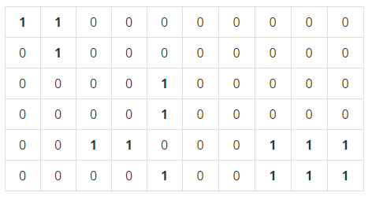

# 0830 BOJ 1012: 유기농 배추


## 문제

차세대 영농인 한나는 강원도 고랭지에서 유기농 배추를 재배하기로 하였다. 농약을 쓰지 않고 배추를 재배하려면 배추를 해충으로부터 보호하는 것이 중요하기 때문에, 한나는 해충 방지에 효과적인 배추흰지렁이를 구입하기로 결심한다. 이 지렁이는 배추근처에 서식하며 해충을 잡아 먹음으로써 배추를 보호한다. 특히, 어떤 배추에 배추흰지렁이가 한 마리라도 살고 있으면 이 지렁이는 인접한 다른 배추로 이동할 수 있어, 그 배추들 역시 해충으로부터 보호받을 수 있다.

(한 배추의 상하좌우 네 방향에 다른 배추가 위치한 경우에 서로 인접해있다고 간주한다)

한나가 배추를 재배하는 땅은 고르지 못해서 배추를 군데군데 심어놓았다. 배추들이 모여있는 곳에는 배추흰지렁이가 한 마리만 있으면 되므로 서로 인접해있는 배추들이 몇 군데에 퍼져있는지 조사하면 총 몇 마리의 지렁이가 필요한지 알 수 있다.

예를 들어 배추밭이 아래와 같이 구성되어 있으면 최소 5마리의 배추흰지렁이가 필요하다.

(0은 배추가 심어져 있지 않은 땅이고, 1은 배추가 심어져 있는 땅을 나타낸다.)



#### 입력

입력의 첫 줄에는 테스트 케이스의 개수 T가 주어진다. 그 다음 줄부터 각각의 테스트 케이스에 대해 첫째 줄에는 배추를 심은 배추밭의 가로길이 M(1 ≤ M ≤ 50)과 세로길이 N(1 ≤ N ≤ 50), 그리고 배추가 심어져 있는 위치의 개수 K(1 ≤ K ≤ 2500)이 주어진다. 그 다음 K줄에는 배추의 위치 X(0 ≤ X ≤ M-1), Y(0 ≤ Y ≤ N-1)가 주어진다.


#### 출력

각 테스트 케이스에 대해 필요한 최소의 배추흰지렁이 마리 수를 출력한다.


## 나의 코드

```python
# BOJ1012: 유기농 배추
# https://www.acmicpc.net/problem/1012
import sys
sys.setrecursionlimit(100000)
sys.stdin = open("input.txt", "r")

# 인덱스가 보드의 범위를 넘어가는지 확인해주는 함수
def check(i, j):
    if i >= 0 and i < N and j >= 0 and j < M:
        return True
    else:
        return False

# 인접해 있는 유기농 배추 체크하는 함수
def cabbage(x, y):
    visited[x][y] = 1   # 방문했을 경우 1로 바꿈
    for d in range(4):
        newX = x + dx[d]
        newY = y + dy[d]
        # 인접한 곳이 1일 경우 그곳에서 다시 함수 호출
        if check(newX, newY) and visited[newX][newY] != 1 and BRD[newX][newY] == 1:
            cabbage(newX, newY)

T = int(input())

# 상하좌우
dx = [-1, 1, 0, 0]
dy = [0, 0, -1, 1]

for test_case in range(1, T+1):
    M, N, K = map(int, input().split())
    BRD = [[0] * M for _ in range(N)]
    visited = [[0] * M for _ in range(N)]

    for _ in range(K):
        X, Y = map(int, input().split())
        BRD[Y][X] = 1

    cnt = 0
    for x in range(N):
        for y in range(M):
            if visited[x][y] == 0 and BRD[x][y] == 1:
                cabbage(x, y)
                cnt += 1

    print(cnt)
```


- 좌표를 탐색하며 값이 1인 좌표를 cabbage 함수로 넘겨준다.

- cabbage 함수에서 인접 좌표(상하좌우)를 탐색하며 값이 1인 인접 좌표가 있을 경우 해당 좌표에서 다시 cabbage를 호출한다.

- 재귀함수의 최대 깊이는 1000이어서 코드를 그냥 제출하면 런타임 에러가 뜬다. 이를 해결하기 위해  아래와 같은 코드를 사용한다.

  ```python
  sys.setrecursionlimit(100000)
  ```

  => 재귀의 깊이를 100000로 설정